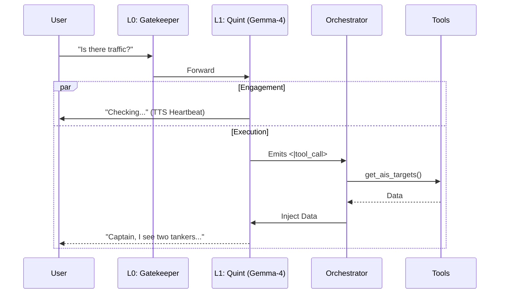

# Captain & Quartermaster: Architecture Roadmap

**Version:** 3.0 (Native NVFP4 Convergence)
**Date:** 2026-06-12
**Target Hardware:** Jetson Thor (Blackwell GPU)

## 1. Vision: "The NVFP4 Convergence"

We have evolved from the multi-layered "Async Cascade" concept to a **Converged Architecture**. By utilizing native NVFP4 4-bit precision on the Jetson Thor's Blackwell Tensor Cores, the massive `Gemma-4` architecture runs fast enough to handle immediate conversational interactions, native tool calling, and deep reasoning *simultaneously*, eliminating the need for a separate L3 Cortex.

### The Problem
Standard agents block conversation while thinking or executing tools. Previously, we solved this by cascading models (L1 for chat, L2 for tools, L3 for reasoning).
### The Solution
We collapsed the cognitive load back into a single hyper-fast unified engine (Gemma-4-E4B-Multimodal NVFP4) which natively parses structured `<|tool_call>` outputs synchronously without dropping conversational latency.

## 2. The Stack (Converged Model)

| Layer | Component | Model / Engine | Role | Latency |
| :--- | :--- | :--- | :--- | :--- |
| **L0** | **The Gatekeeper** | `Snowflake-Arctic-Embed-XS` | **Bouncer**: Router & Noise Filter. | < 10ms |
| **L1** | **The Converged Engine** | `Gemma-4-E4B-Multimodal` | **Unified Intelligence**: Personality, Native Tool Calling, and Deep Reasoning. | < 100ms |

### Layer Details

#### L0: The Gatekeeper
*   **Function:** Vector similarity search against a "Hot List".
*   **Routes:**
    *   `ignore`: Background noise.
    *   `engage`: Standard chat and complex mission requests (Pass to L1).

#### L1: The Converged Engine (Quint)
*   **Function:** Fast, multimodal chat and orchestration.
*   **Behavior:** Acknowledges user immediately via asynchronous heartbeats while parsing natively emitted `<|tool_call>` boundaries. It executes tools, ingests output, and summarizes findings via a unified VLLM TensorRT-LLM backend.

## 3. Data Flow

*User asks a question. L1 responds with heartbeats. L1 emits a tool call. Orchestrator executes tool and injects output into context. L1 finalizes response.*

## 4. Hardware Considerations (Jetson Thor)
*   **VRAM Strategy (Unified Memory):**
    *   **Gemma-4 (NVFP4):** ~20GB
    *   **Cosmos Vision (FP8):** ~3GB
    *   **Context/KV Cache:** ~10GB
    *   **Total Usage:** ~33GB / 128GB (Ample headroom).

## 5. Implementation Roadmap
*   [x] **NVFP4 Migration**: Upgraded container infrastructure and `agent_orchestrator.py` to use TensorRT-LLM and NVFP4.
*   [x] **Native Tool Calling**: Removed `FunctionGemma-270m` and integrated Gemma-4 native tool parsing.
*   [x] **Architecture Convergence**: Disabled Nemotron-30B (L3).
*   [x] **Watchstander Dashboard**: Deployed containerized vision service with video playback and Sentinel telemetry on port 8080.
