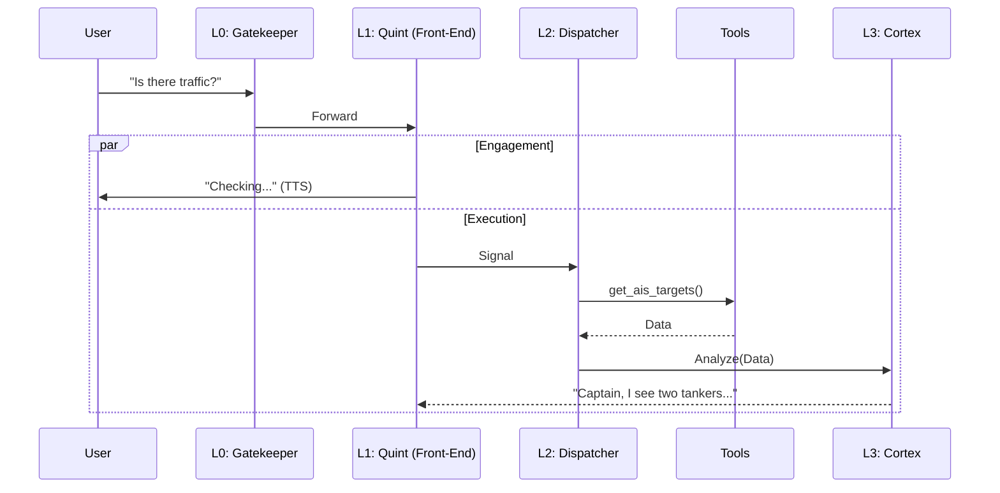
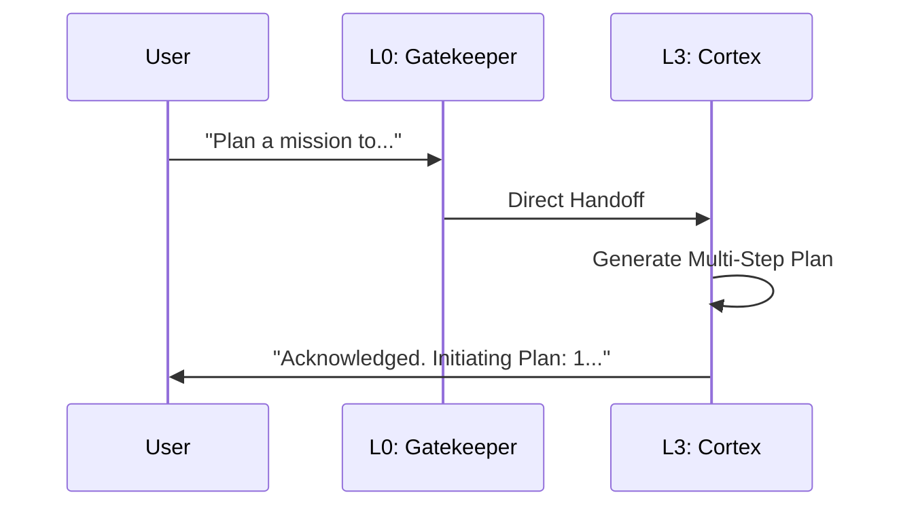

# Captain & Quartermaster: Architecture Roadmap

**Version:** 2.0 (Async Cascade)
**Date:** 2026-02-10
**Target Hardware:** Jetson Thor (Blackwell GPU)

## 1. Vision: "The Async Cascade"

We have evolved from the synchronous "Parallel Brain" concept to the **Async Cascade** architecture. This design solves the latency-vs-intelligence trade-off by decoupling **Engagement** (Chat) from **Action** (Tools/Reasoning), allowing "Quint" (Chatty Buoy) to provide sub-100ms conversational latency while asynchronously performing complex reasoning and tool execution.

### The Problem
Standard agents block conversation while thinking or executing tools, creating awkward silence.
### The Solution
We split the cognitive load into specific layers that run in parallel streams on the Jetson Thor:
*   **The Face (L1):** Dedicated to immediate, fluid conversation.
*   **The Hands (L2):** Dedicated to tool execution.
*   **The Brain (L3):** Dedicated to deep reasoning and planning.

## 2. The Stack (4-Layer Model)

| Layer | Component | Model / Engine | Role | Latency |
| :--- | :--- | :--- | :--- | :--- |
| **L0** | **The Gatekeeper** | `Snowflake-Arctic-Embed-XS` | **Bouncer**: Router & Noise Filter. | < 10ms |
| **L1** | **The Front-End** | `Gemma-3-4B-IT` | **Face**: Personality, Vision, Chat. | < 100ms |
| **L2** | **The Dispatcher** | `FunctionGemma-270m` | **Hands**: Structured Tool Calling. | ~200ms |
| **L3** | **The Cortex** | `Nemotron-3-30B` | **Brain**: Deep Reasoning & Planning. | 2-5s |

### Layer Details

#### L0: The Gatekeeper
*   **Function:** Vector similarity search against a "Hot List".
*   **Routes:**
    *   `ignore`: Background noise.
    *   `engage`: Standard chat (Pass to L1).
    *   `planning`: Complex mission request (Direct pass to L3).

#### L1: The Front-End (Quint)
*   **Function:** Fast, multimodal chat.
*   **Behavior:** Acknowledges user immediately ("Checking that for you...") and *asynchronously* triggers L2 for data.

#### L2: The Dispatcher
*   **Function:** Converts natural language to JSON tool calls.
*   **Efficiency:** 270M parameters means instant execution on Thor.

#### L3: The Cortex
*   **Function:**
    1.  **Analysis**: Consumes tool outputs from L2 and generates a strategic update.
    2.  **Planning**: Generates multi-step mission plans when triggered directly by L0.

## 3. Data Flow & Modes

### Mode A: Standard Chat (Async Fork)
*User asks a question. L1 responds immediately. L2 fetches data. L3 analyzes and updates.*

### Mode B: Planning Mode (Deep Thought)
*User invokes hotword ("Plan", "Mission"). L0 bypasses L1/L2. L3 takes full control.*

## 4. Hardware Considerations (Jetson Thor)
*   **VRAM Strategy (Unified Memory):**
    *   **Nemotron-30B (FP4):** ~18GB
    *   **Gemma-3-4B (FP8):** ~5GB
    *   **FunctionGemma (FP16):** ~0.6GB
    *   **Context/KV Cache:** ~20GB
    *   **Total Usage:** ~45GB / 128GB (Ample headroom for Vision).

## 5. Implementation Roadmap

### Phase 1: Foundation (Completed)
*   [x] Container Infrastructure (Docker Compose).
*   [x] Audio Pipeline (PulseAudio -> Riva ASR -> TTS).
*   [x] Basic Orchestrator V1.

### Phase 2: The Async Cascade (Completed)
*   [x] **L2 Dispatcher**: Deployed `FunctionGemma-270m` service.
*   [x] **L1 Front-End**: Deployed `Gemma-3-4B` service.
*   [x] **Orchestrator V2**: Implemented Async Fork logic.
*   [x] **L3 Integration**: Connected `Nemotron-30B` for reasoning.

### Phase 3: Planning Capabilities (Completed)
*   [x] **Hotword Router**: Added `planning` route to Gatekeeper.
*   [x] **Meta-Planner**: Implemented direct L3 planning loop.

### Phase 4: Vision & Multimodality (Next)
*   [ ] **Camera Integration**: Feed RTSP/USB camera to L1 (Gemma-3).
*   [ ] **Vision Tools**: Add object detection tools for L2.
*   [ ] **Visual Reasoning**: Enable L3 to analyze scene descriptions.

### Phase 5: Hardware Deployment
*   [ ] **Jetson Thor Test**: Deploy containers to physical hardware.
*   [ ] **Performance Tuning**: TensorRT-LLM optimization.
