# Quintessential Architecture: The "Speed Demon" Hybrid Stack

This document outlines the realized architecture of the **Thor Semantic Audio Agent**, designed specifically for the NVIDIA Jetson AGX Thor. It prioritizes ultra-low latency (<500ms), offline capability, and high-fidelity voice interaction.

## Core Philosophy

1.  **Hybrid Compute**: 
    *   **Docker Containers** for heavy, standardized infrastructure (ASR, Cortex, Memory).
    *   **Native Execution** for latency-sensitive or hardware-specific components (TTS on Metal/CUDA, Audio I/O).
2.  **Modular Microservices**: Each component (Audio, Cortex, Voice) is independent, allowing for individual scaling and model upgrades.
3.  **Data-Centric Memory**: A centralized Vector Database (Postgres) serves as the "Long Term Memory," accessible to the Cortex for RAG.

## The Stack

### 1. Audio (Hearing)
*   **Service**: `asr-service`
*   **Software**: NVIDIA Riva (Release 2.24.0-l4t-aarch64)
*   **Model**: `Parakeet-TDT-1.1B` (Streaming Transducer)
*   **Role**: Converts raw audio stream to text in real-time with high accuracy and noise robustness.
*   **Protocol**: gRPC streaming.

### 2. Cortex (Reasoning)
*   **Service**: `cortex-service`
*   **Software**: `vllm` (v0.6.3.post1 / 25.12.post1)
*   **Model**: `Olmo3-7B` (Primary).
*   **Option**: `NVIDIA-Nemotron-3-Nano-30B-A3B-NVFP4` (Optimized for Thor NVFP4).
*   **Role**: Reasoning engine. Receives text, queries memory (RAG), and generates intelligent responses.
*   **Optimization**: Native Blackwell **FP4 Tensor Core** support via `VLLM_USE_FLASHINFER_MOE_FP4=1` (for Nemotron).
*   **Interface**: OpenAI-Compatible API (`localhost:8000/v1`).

### 3. Voice (Speaking)
*   **Service**: Local Process (`scripts/start_tts.sh`)
*   **Software**: `KokoroTTS`
*   **Runtime**: Native Python/PyTorch (FP8/BF16)
*   **Role**: Synthesizes text into high-quality human-like speech.
*   **Why Local?**: Eliminates x86-to-ARM (QEMU) emulation overhead found in many community Docker containers, ensuring maximum GPU utilization.

### 4. Memory (RAG)
*   **Service**: `postgres-vector`
*   **Software**: PostgreSQL 17 + `pgvector` extension
*   **Role**: Stores embeddings of documents (PDFs, manuals, logs).
*   **Ingestion**: `rag_ingest.py` parses and indexes content.

### 5. The "Reflex" Orchestrator
*   **Component**: `src/agent_reflex.py`
*   **Role**: The central nervous system.
    *   **Audio Pipeline**: GStreamer (ALSA Src -> VAD -> Riva -> ALSA Sink).
    *   **Logic**: Manages turn-taking, barge-in (interruption), and routing (Simple Reflexes vs. Deep Reasoning).

## Data Flow

```mermaid
sequenceDiagram
    participant User
    participant GStreamer (Agent)
    participant Riva (ASR)
    participant Triton (Cortex)
    participant KokoroTTS (TTS)

    User->>GStreamer: Speaks
    GStreamer->>Riva: Stream Audio
    Riva->>GStreamer: Partial Transcript
    Riva->>GStreamer: Final Transcript
    
    rect rgb(20, 20, 20)
        Note over GStreamer: "Reflex" Decision Layer
        GStreamer->>Triton: Send Query (if complex)
        Triton->>GStreamer: Text Response
    end
    
    GStreamer->>KokoroTTS: Synthesize Response
    KokoroTTS->>GStreamer: Audio Stream
    GStreamer->>User: Plays Audio
```

