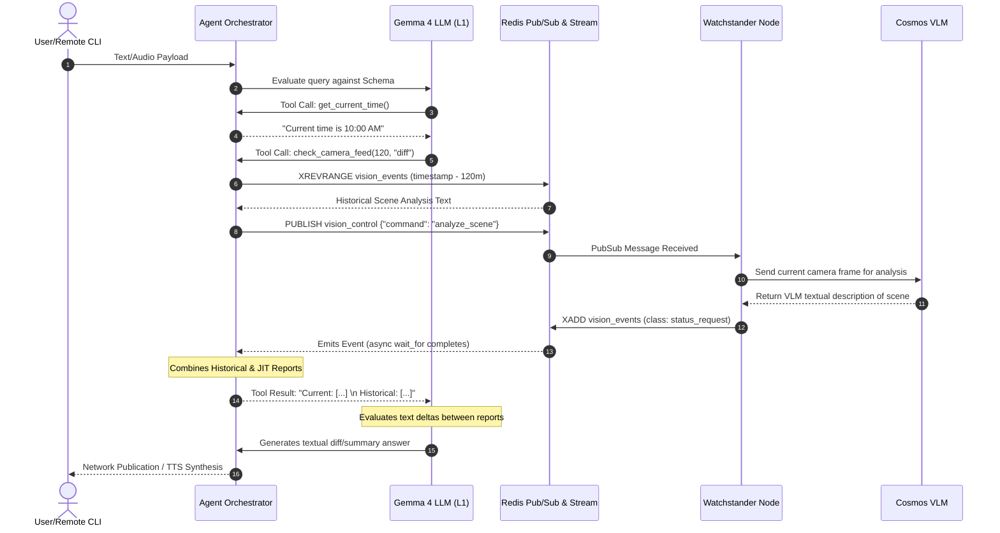

# Quintessential Architecture: The "Async Cascade" Stack

This document outlines the realized architecture of the **Thor Semantic Audio Agent**. It prioritizes ultra-low latency (<500ms) for chat, asynchronous deep reasoning for complex tasks, and robust tool integration.

## Core Philosophy

1.  **Async Fork**: Split the conversation flow into two parallel tracks:
    *   **L1 (Fast Chat)**: Immediate, conversational response using a lightweight model (`Gemma-3-4B`).
    *   **L2 (Dispatcher)**: Simultaneous analysis of intent for tool calling using a specialized model (`FunctionGemma`).
2.  **Deep Reasoning (L3)**: When tools are called or complex planning is needed, the `dispatcher` invokes the **Cortex** (`Nemotron-30B` or `Olmo-3-7B-Think`) to analyze data and formulate strategic responses.
3.  **Hybrid Compute**: 
    *   **Docker Containers** for standardized AI services (ASR, L1, L2, L3).
    *   **Native Execution** for audio I/O and orchestration to minimize latency.

## The Stack

### 1. Audio (Hearing)
*   **Service**: `asr-service`
*   **Software**: NVIDIA Riva (Release 2.24.0)
*   **Model**: `Parakeet-TDT-1.1B` (Streaming Transducer)
*   **Role**: real-time speech-to-text.

### 2. The Brains (Cognition)
The agent uses a tiered cognitive architecture:

#### L1: Front-End (Chatter)
*   **Service**: `front-end-service`
*   **Model**: `google/gemma-3-4b-it`
*   **Role**: Persona, Chit-chat, Memory Summarization.
*   **Latency**: < 200ms TTFT.

#### L2: Dispatcher (Reflex)
*   **Service**: `dispatcher-service`
*   **Model**: `google/functiongemma-270m-it`
*   **Role**: Tool Selection & Argument Parsing.
*   **Schema**: Defined in `src/orchestrator/tool_schema.py`.

#### L3: Cortex (Reasoning)
*   **Service**: `cortex-service`
*   **Model**: `allenai/Olmo-3-7B-Think` OR `nvidia/Nemotron-3-30B`
*   **Role**: Strategic Planning, RAG, Complex Analysis, Output Formulation.

### 3. Vision (Sight) - "The Watchstander"
*   **Service**: `vision-service`
*   **Models**: 
    *   **Spotter**: `YOLO-26N` (Nano) - Optimized for DLA/Edge efficiency.
    *   **Navigator**: `YOLO-11S-OBB` (Oriented Bounding Box) - For precise heading/aspect analysis.
*   **Role**: 
    *   **Spotter**: High-FPS anomaly detection (Kitchen/Marine modes).
    *   **Navigator**: Triggered analysis for calculating bearing, range, and collision risk.
*   **Reference**: 
    *   [Ultralytics NVIDIA Jetson Guide](https://docs.ultralytics.com/guides/nvidia-jetson/)
    *   [YOLO-26N Paper](https://arxiv.org/abs/2509.25164)

### 4. Voice Synthesis (TTS) - "The Voice"
**Engine:** Chatterbox-Turbo (350M)
**Why:**
- **Expressivity:** Native support for paralinguistic tags (`[laughter]`, `[sighs]`, `[breaths]`).
- **Latency:** ~200ms time-to-first-audio.
- **Persona:** Finetuned/Prompted with "Quint" voice profile (`quint-processed.wav`).

**Configuration:**
- **Input:** Text + Tags (e.g. `"[sigh] I don't know about that."`)
- **Output:** 24kHz PCM Audio.
- **Hardware:** GPU 0 (Thor).

> **Note (Fallback):** The lightweight **Kokoro-82M** model is supported as a fallback option via `docker-compose.kokoro.yaml`. It uses the `ghcr.io/remsky/kokoro-fastapi-gpu:latest` image to simplify deployment.
*   **Role**: 
    *   Manages Audio streams (SoundDevice + VAD).
    *   **Async Fork**: Sends user text to L1 and L2 simultaneously.
    *   **Tool Execution**: Executes tools from L2, feeds results to L3.
    *   **State Management**: Handling Interrupts and Threading.

## Data Flow: Watchstander & Vision Analytics

The Watchstander ecosystem utilizes Redis to separate the Orchestrator from the heavy Vision Language Models (VLM). This permits "Just-In-Time" updates, historical stream-based diffs, and passive event monitoring.

### Workflow Highlights

*   **Time Resolution & Temporal Diffing**: The L1 agent natively understands temporal context via multi-step logic. If asked "What changed since 8am?", the agent dynamically executes `get_current_time()`, deduces the required minute-delta, and invokes `check_camera_feed(time_window_minutes=X, report_type="diff")`.
*   **Redis Event Stream Context**: To power the diff, the Orchestrator simultaneously performs a reverse lookup on the Redis `vision_events` stream (`XREVRANGE`) for the historical period, while publishing (`PUBLISH`) a request to the background Watchstander node to capture a fresh frame and process it through the Cosmos VLM. 
*   **Headless "Silent Mode" (TUI/CLI)**: The architecture fully supports removing hardware audio pathways. Running the orchestrator via `--silent` disables the Riva ASR and Chatterbox TTS engines, shifting the system into a background daemon. Users can interact via a Remote CLI using two-way Redis Pub/Sub channels (`inbound_chat`/`outbound_chat`), paving the way for standard FastAPI and OpenAI-compatible endpoint adoption.
*   **Cortex Escalation & RAG integration**: If the scene description generated by Cosmos reflects severe anomalies requiring deep analysis (like maritime collision courses or complex environmental situations), the L2 Dispatcher can escalate the visual text payload to the L3 Cortex for extended reasoning and RAG-based ruleset lookup before providing the final narrative output to the user.

## Data Flow: The Async Cascade

```mermaid
sequenceDiagram
    participant User
    participant Orchestrator
    participant L1 (Gemma-4B)
    participant L2 (Dispatcher)
    participant Tools (System)
    participant L3 (Cortex)

    User->>Orchestrator: Audio Input
    Orchestrator->>Orchestrator: ASR & VAD

    rect rgb(20, 20, 20)
        note right of Orchestrator: Async Fork
        par Parallel Execution
            Orchestrator->>L1 (Gemma-4B): Chat Query
            L1 (Gemma-4B)->>Orchestrator: Streaming Text (TTS)
        and
            Orchestrator->>L2 (Dispatcher): Tool Check
            L2 (Dispatcher)->>Orchestrator: JSON Tool Call (if any)
        end
    end

    alt Tool Call Received
        Orchestrator->>Tools: Execute (e.g., get_jetson_telemetry)
        Tools->>Orchestrator: Result (JSON/Text)
        Orchestrator->>L3 (Cortex): Analyze Result & Plan
        L3 (Cortex)->>Orchestrator: Strategic Response
        Orchestrator->>User: Audio Output (Update)
    end
```

